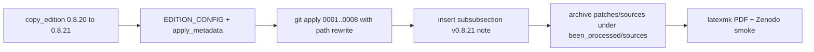

# Canon v0.8.21 uit eight-source patch series

## Context

Patch-pakket: [`SST-CANON/to_do_patches/SST_CANON-v0.8.20-eight-source-patch-series/`](c:/workspace/projects/SwirlStringTheory/SST-CANON/to_do_patches/SST_CANON-v0.8.20-eight-source-patch-series/)

- 8 patches (`0001`–`0008`) in lexicale volgorde; raken **main** + **research-track**
- Packaged `BASE/` is **byte-identiek** aan huidige [`been_processed/v0.8.20/`](c:/workspace/projects/SwirlStringTheory/SST-CANON/been_processed/v0.8.20/) (SHA-256 match) — `git apply` moet daarom schoon lukken
- Pakket zelf verandert geen versienummer; wij bump naar **0.8.21** via het bestaande edition-pad

Zenodo leest changelog automatisch uit [`canon_edition.py`](c:/workspace/projects/SwirlStringTheory/SST-CANON/been_processed/canon_edition.py) `EDITION_CONFIG` via [`publish_canon_zenodo.get_edition_changelog`](c:/workspace/projects/SwirlStringTheory/tools/zenodo_tools/publish_canon_zenodo.py) — geen aparte edit in `publish_canon_zenodo.py` nodig.

## Aanpak (zoals v0.8.20)



### 1. Register edition in `canon_edition.py`

Toevoegen:

- `EDITION_CONFIG["0.8.21"]` met `prev: "0.8.20"`, header, en note die de 8 bronnen samenvat (curl-spectrum, writhe/helicity bounds, Gehring/contact, Biot–Savart, Hodge/circulatie, helicity-forms/mapping-class, isoperimetric spectrum, Ridgerunner-certificatie) met `\ref{...}` naar nieuwe labels waar die in de diffs staan
- `EDITION_KEYWORDS["0.8.21"]` (korte keywords voor `\paperkeywords` / Zenodo)

### 2. Scripts onder `been_processed/scripts/`

- [`apply_v0821.py`](c:/workspace/projects/SwirlStringTheory/SST-CANON/been_processed/scripts/apply_v0821.py) — spiegel van `apply_v0820.py`: `copy_edition` → `apply_metadata` → `insert_edition_note` (anker `\subsubsection{v0.8.20}`) → zenodo.json copy
- [`apply_v0821_patches.py`](c:/workspace/projects/SwirlStringTheory/SST-CANON/been_processed/scripts/apply_v0821_patches.py):
  - Bron: `SST-CANON/to_do_patches/SST_CANON-v0.8.20-eight-source-patch-series/patches/*.diff`
  - Doel: `been_processed/v0.8.21/`
  - Pad-rewrite in elke diff: `SST_CANON-v0.8.20` → `SST_CANON-v0.8.21` (bestanden heten na `copy_edition` al `v0.8.21`)
  - `git apply --check` dan `git apply` in lexicale volgorde; idempotent SKIP als marker-labels al aanwezig (bijv. `subsec:rt_spherical_curl_spectrum_capacity`)

### 3. Archiveren

Kopieer naar [`been_processed/sources/`](c:/workspace/projects/SwirlStringTheory/SST-CANON/been_processed/sources/) (zoals eerdere queues):

- `v0.8.21_0001_…diff` … `v0.8.21_0008_….diff` (of één map `v0.8.21_eight_source_patch_series/` met patches + korte README/provenance-pointer)
- Geen PDF-bronnen verplicht te dupliceren als ze groot zijn; provenance-link naar `to_do_patches/.../SOURCE_PROVENANCE.md` volstaat

### 4. Build + verify

```powershell
cd SST-CANON/been_processed
python scripts/apply_v0821.py
python scripts/apply_v0821_patches.py
cd v0.8.21
latexmk -pdf -interaction=nonstopmode -output-directory=$out SST_CANON-v0.8.21.tex
```

Smoke:

```powershell
python -c "from canon_edition import edition_dir; print(edition_dir('0.8.21'))"
cd ../tools/zenodo_tools
python -c "from publish_canon_zenodo import is_known_canon_version, get_edition_changelog; assert is_known_canon_version('0.8.21'); print(get_edition_changelog(refresh=True)['0.8.21'][:120])"
```

## Belangrijke details

- **Volgorde metadata vs patches:** eerst scaffold + metadata (filenames/version strings), daarna patches met path-rewrite — anders matchen de diffs niet.
- **Edition note:** gebruik het bewezen `\subsubsection{v…}`-anker uit `apply_v0820.py` (niet de verouderde `Canon edition notes (v{prev})`-tak in `apply_metadata`, die in v0.8.20 niet zo heet).
- **v0.8.20 blijft ongewijzigd**; alleen nieuwe map `v0.8.21/`.
- Patch `0008` herstelt o.a. de contact-map heading — dat is gewenst en al in de gevalideerde final aanwezig.
