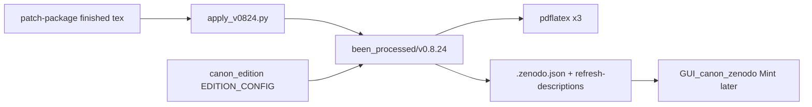

# Canon v0.8.24: ingest + Zenodo-GUI klaar

## Keuze: finished tex, niet opnieuw patchen

Het pakket bevat al gevalideerde endpoints (`SST_CANON-v0.8.24.tex`, `…-research-track.tex`, PDF 213 pp., `VALIDATION.md`). Zelfde route als v0.8.23: **ingest finished files**; patches alleen archiveren voor provenance. Patches opnieuw toepassen alleen als SHA/byte-check tegen lokale `v0.8.23` faalt en de geleverde tex ontbreekt — dat is hier niet het geval.

Bronmap: [`SST-CANON/to_do_patches/SST_CANON-v0.8.23-to-v0.8.24-patch-package/`](c:/workspace/projects/SwirlStringTheory/SST-CANON/to_do_patches/SST_CANON-v0.8.23-to-v0.8.24-patch-package/).

## Stappen

### 1. Register edition metadata

In [`been_processed/canon_edition.py`](c:/workspace/projects/SwirlStringTheory/SST-CANON/been_processed/canon_edition.py):

- `EDITION_CONFIG["0.8.24"]` met `prev: 0.8.23`, korte `header` + `note` uit pakket-[`CHANGELOG.md`](c:/workspace/projects/SwirlStringTheory/SST-CANON/to_do_patches/SST_CANON-v0.8.23-to-v0.8.24-patch-package/CHANGELOG.md) (core–torsion `E_0 I / c_T^2`, compact U(1) phase gate, link-spacing scenarios, zero-legacy star basis, four-class failure taxonomy, geometry certification / sector separation).
- `EDITION_KEYWORDS["0.8.24"]`: o.a. core-torsion normalization, compact U(1), link spacing, zero-legacy, failure taxonomy.

Dit voedt automatisch Zenodo “Version changelog” via `get_edition_changelog`.

### 2. Ingest script

Nieuw [`been_processed/scripts/apply_v0824.py`](c:/workspace/projects/SwirlStringTheory/SST-CANON/been_processed/scripts/apply_v0824.py) (spiegel van `apply_v0823.py`):

- Kopieer finished main + RT tex uit het patch-package → `been_processed/v0.8.24/`.
- Optioneel: kopieer geleverde PDF naar `v0.8.24/$out/` als referentie; daarna **lokale rebuild** (bron van waarheid).
- Seed `.zenodo.json` vanuit `v0.8.23` (zonder fake DOI-claim; of leeg `deposit_id`/`doi` wissen zodat GUI **Mint** toont i.p.v. stale).
- Archiveer pakketbestanden onder `been_processed/sources/v0.8.24_core_torsion_phase_gate/` (patches, CHANGELOG, VALIDATION, APPLY, SHA256SUMS, README).

### 3. Edition note in tex (indien nodig)

Als de geleverde tex al een v0.8.24 edition-header/note heeft: behouden. Anders injecteren via bestaande `apply_edition` / handmatige sync met `EDITION_CONFIG` (zelfde patroon als eerdere editions).

### 4. Build + sanity

- 3× `pdflatex` op main (verwacht ~213 pp., 0 undefined refs per VALIDATION).
- Quick greps uit `APPLY.txt`: geen `canon-0.8.1-research-track`; geen substrate `Æther element`; `2E_0` alleen in historical notes.

### 5. Zenodo GUI klaar (geen push)

- `python publish_canon_zenodo.py --refresh-descriptions` (of alleen v0.8.24) zodat lokale description/changelog klopt.
- Locale status: `0.8.24` = mint-klaar (`missing_config` / ready to mint), **niet** remint van 0.8.21–23 in dit werk.
- Geen `--push-metadata` / geen PDF-upload; jij mint/pusht één versie tegelijk in de GUI (na published parent; praktisch na 0.8.20 publish of vanaf laatste published 0.8.19 + sequential policy).

## Buiten scope

- Remint/push van 0.8.20–0.8.23
- `git apply` die v0.8.23 bestanden hernoemt/verwijdert in `been_processed` (we laten v0.8.23 staan)
- Massa-DOI-correctie

## Tests

- Smoke: `apply_v0824.py` idempotent / folder bestaat met main+RT.
- Changelog: `get_edition_changelog()["0.8.24"]` bevat geen `Gemini` en wel kernphrase uit header.
