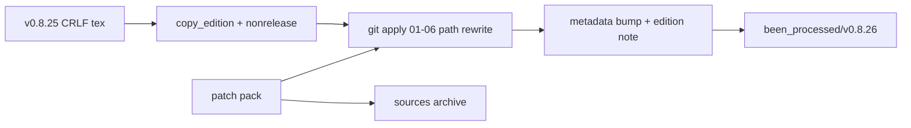

# Canon v0.8.26: audit patch pack toepassen

## Globale regel: Zenodo mint/push

**Jij** doet altijd zelf Zenodo mint / remint / publish / `--push-metadata` / PDF-upload. Agents doen dat nooit, ook niet “even voor één versie”, tenzij jij dat in die chat expliciet vraagt.

Tijdens uitvoering van dit plan:

- Nieuwe alwaysApply Cursor-regel in [.cursor/rules/](c:/workspace/solo_projects/Swirl-String-Theory/.cursor/rules/) (bijv. `zenodo-user-mint-push.mdc`): verbied mint/push/publish; sta alleen lokale `.zenodo.json` seeding / description refresh zonder netwerk-push toe.
- Edition-scripts mogen wél een **lokale** mint-ready `.zenodo.json` seeden (zonder `deposit_id`/`doi`) en `\paperdoi` leegmaken — klaar voor jouw GUI, niet gepusht.

## Patch-pakket (geverifieerd door leverancier)

Zes `patch -p1`-compatibele diffs, CRLF-byte-exact tegen de bronbestanden; individueel dry-run OK; sequentieel byte-identiek aan `final/`; pdflatex van het gepatchte paar: 0 errors.

| Patch | Inhoud |
|-------|--------|
| `01_fmax_rydberg_factor2` | Fatale fix: $32\pi^2 \to 16\pi^2$ in boxed `eq:Fmax_Rydberg` + `[ERRATUM]`-zin (factor-2 documentatie) |
| `02_rho_calc_retirement` | $\rho_{\rm calc}$ → $\rho_{\rm horn}^{\rm eff}$ in `eq:Fmax_rho` + `[NOTATION RETIREMENT]` |
| `03_M0_transparency_guard` | `[CALIBRATED ALGEBRAIC IDENTITY / TRANSPARENCY GUARD]`; $M_0(T)=\tfrac{m_e}{4}\mathcal{L}_{\rm tot}(T)$ als `eq:M0_me_quarter_reduction`; $M_0(3_1)=4.0929\,m_e$ |
| `04_rhof_provenance_guard` | Provenance-guard: $\rho_f$ heeft 2 sig. cijfers, geen kalibratiedoel; onzekerheidspropagatie-regel |
| `05_label_discipline` | $\Gamma_0$: `[DERIVED within the calibrated chain]`; spring-energie: `[CONDITIONAL DERIVED, n=2 posited]` |
| `06_rt_dedup_and_label` | RT-header duplicatie-guard (zeven dubbele secties) + Pauli `[DERIVED]` → `[ORTHODOX]` |

`verify_v0_8_25_patched.py` bevestigt de drie wiskundige claims op machineprecisie en ongewijzigde canonieke ankers (lokaal al groen).

## Lokale feiten

- Bron: [been_processed/v0.8.25/](c:/workspace/solo_projects/Swirl-String-Theory/SST-CANON/been_processed/v0.8.25/) — main is pristine (`32 pi^2`); **volledig CRLF** (7146 regels, 378815 bytes).
- Pack: [to_do_patches/0.8.25-to-0.8.26/](c:/workspace/solo_projects/Swirl-String-Theory/SST-CANON/to_do_patches/0.8.25-to-0.8.26/).
- Diff-paden gebruiken underscores (`SST_CANON-v0_8_25*.tex`); been_processed en `\input{…}` gebruiken **punten** (`SST_CANON-v0.8.25-research-track`). Na bump: `\input{SST_CANON-v0.8.26-research-track}`.
- **Default:** nonrelease-appendix 1:1 meenemen naar `v0.8.26/` (ongepatched; niet geinput door main).

## Aanpak

Volgorde: **eerst patches 01–06, dan versie-bump**. Patch 06 matched `Editorial note (v0.8.25)`; die context mag nog niet herschreven zijn.

### 1. Register 0.8.26 in [canon_edition.py](c:/workspace/solo_projects/Swirl-String-Theory/SST-CANON/been_processed/canon_edition.py)

- `EDITION_CONFIG["0.8.26"]` / `prev: "0.8.25"` met note die bovenstaande zes items samenvat.
- `EDITION_KEYWORDS["0.8.26"]`: Fmax Rydberg erratum, rho_calc retirement, M0 transparency, rho_f provenance.

### 2. Script [scripts/apply_v0826.py](c:/workspace/solo_projects/Swirl-String-Theory/SST-CANON/been_processed/scripts/apply_v0826.py)

1. `copy_edition("0.8.25", "0.8.26")` + nonrelease-kopie (binary/`copy2` → CRLF behouden).
2. Diff-padheaders `SST_CANON-v0_8_25` → `SST_CANON-v0.8.26`; geen content-versies in hunks wijzigen.
3. **CRLF-hard:** herschreven diffs en temp-files niet via `newline="\n"` forceren (dat breekt de pack-claim). Binary rewrite of tekst met `\r\n` behouden; na apply controleren dat output-tex nog CRLF is.
4. `git apply --check` daarna apply, volgorde 01→06, cwd = `v0.8.26/`.
5. Marker-checks: ERRATUM, `eq:M0_me_quarter_reduction`, NOTATION RETIREMENT, PROVENANCE GUARD, RT duplication guard, ORTHODOX Pauli-regel.
6. Optioneel vóór metadata: content vs `final/` (na pad-normalisatie) moet overeenkomen met de cumulatieve patch.
7. Daarna `apply_metadata("0.8.26")` + `\subsubsection{v0.8.26}` insert vóór `\subsubsection{v0.8.25}`.
8. Lokale mint-ready config alleen: clear `\paperdoi` / seed `.zenodo.json` zonder `deposit_id`/`doi` — **geen** mint/push.
9. Archiveer onder `been_processed/sources/v0.8.26_audit_patch_pack/`.

### 3. Changelist

- [been_processed/README.md](c:/workspace/solo_projects/Swirl-String-Theory/SST-CANON/been_processed/README.md): edition-map rij **v0.8.26** + rebuild/build-pointers.
- [sources/INTEGRATION_INDEX.md](c:/workspace/solo_projects/Swirl-String-Theory/SST-CANON/been_processed/sources/INTEGRATION_INDEX.md): pack → v0.8.26.

### 4. Verificatie

- `verify_v0_8_25_patched.py`.
- Marker-greps + CRLF-check op `v0.8.26` main/RT.
- Guard: main input geen nonrelease; RT-`\input` gebruikt dotted `v0.8.26` naam.
- Optioneel: pdflatex smoke (pack claimde 0 errors).

## Buiten scope (bewust)

- Volledige de-duplicatie van de zeven gemigreerde secties (patch 06 zet alleen een hek)
- Pre-existing duplicate labels (`sec:atomic`, `sec:consistency`, `sec:delay`, `sec:spectroscopy`, `sec:unification`)
- `\canonversion` / stale inline version strings
- RT benchmark lege predictive-candidate cellen
- **Elke** Zenodo mint / remint / publish / push / PDF-upload (globale gebruikersregel)
