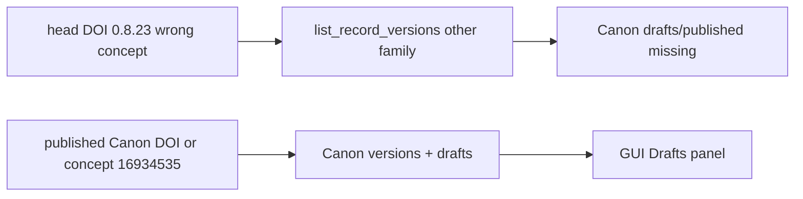

# Canon Zenodo GUI: Update Config + aparte drafts

## Scope change vs Gemini-plan

- Lokale Gemini-scrub (`canon_edition.py`, tex notes, `--refresh-descriptions`) blijft zoals gedaan.
- **Geen** `--push-metadata` / geen PDF-herupload in dit werk — jij pusht later zelf, één versie tegelijk.
- Jouw DOI-+1 blijft onaangeroerd; we forceren geen DOI-rewrites.

## Root cause (waarom Online bijna leeg is)

[`resolve_latest_head_doi`](c:/workspace/projects/SwirlStringTheory/tools/zenodo_tools/publish_canon_zenodo.py) pakt de nieuwste lokale config-DOI. Nu is dat `0.8.23` → `10.5281/zenodo.21249060`, wat **niet** in de Canon-familie zit.

Echte Canon-`conceptrecid` (via deposits): **`16934535`** (o.a. published `0.8.8`/`0.8.19`; draft `0.8.20` = deposit `21527848`, state `unsubmitted`).

Daardoor faalt [`fetch_online_canon_versions`](c:/workspace/projects/SwirlStringTheory/tools/zenodo_tools/publish_canon_zenodo.py) en werkt `can_push_metadata` / draft-detectie niet.

## 1. Discovery fix (backend)

In [`publish_canon_zenodo.py`](c:/workspace/projects/SwirlStringTheory/tools/zenodo_tools/publish_canon_zenodo.py):

- **`resolve_canon_concept_anchor(local, automation)`**: kies een anker in de Canon-familie:
  1. nieuwste lokale config waarvan deposit `conceptrecid ==` bekende Canon (of title matcht Canon), of
  2. fallback `ROOT_DOI` / laatst bekende published Canon-DOI (bijv. `0.8.19`), **niet** een willekeurige nieuwste lokale DOI.
- Laat `fetch_online_canon_versions` dat anker gebruiken i.p.v. blind `resolve_latest_head_doi`.
- Extra: verzamel **alle** token-drafts met Canon/Swirl-String in title (ook als version-parse faalt) voor de drafts-UI — orphans blijven zichtbaar.
- Houd published + drafts in één online-lijst; markeer `state=draft|published`. Dedup behouden, maar drafts niet laten verdwijnen achter wrong-head.

API-paden (conform [Zenodo representation](https://developers.zenodo.org/#representation)):

- Draft metadata: `PUT /api/deposit/depositions/{id}` (files ongemoeid).
- Published metadata-edit: bestaande `edit_deposit` → update → `publish` (al in `push_published_metadata`).

## 2. Nieuwe acties (backend)

| Functie | Gedrag |
|---------|--------|
| `update_config_no_pdf(version, …)` | `refresh_zenodo_config_description` + metadata naar Zenodo **zonder files**. Draft: alleen PUT. Published: bestaande edit/publish-flow. |
| `bind_draft_to_local_version(deposit_id, version, …)` | Koppel online draft aan lokale `v0.8.x`: schrijf `deposit_id`/`doi` in `.zenodo.json`, zet draft metadata (`title`/`version`/`description`/keywords) vanuit lokale bron. **Geen** PDF-upload. Tex-DOI alleen bijwerken als die nog ontbreekt/afwijkt van de prereserved DOI van die draft. |

Geen nieuwe version-mint via `create_new_version` in de “replace”-knop — alleen bestaande draft hergebruiken.

## 3. GUI ([`GUI_canon_zenodo.py`](c:/workspace/projects/SwirlStringTheory/tools/zenodo_tools/GUI_canon_zenodo.py))

- **Online-panel splitsen**:
  - Published (state published)
  - **Drafts** apart (state draft; toon `deposit_id`, title/version-hint, DOI)
- Nieuwe knop **Update Config**: enabled als er een lokale config+DOI is en een matching online draft of published record; roept `update_config_no_pdf` aan. Bevestigingsdialoog: “geen PDF”.
- **Replace draft**: selecteer een item in Drafts → dialog met beschikbare lokale canon-versies (tex aanwezig; nog niet published online, of al gekoppeld aan díe draft) → `bind_draft_to_local_version`.
- Bestaande **Push Selected as Draft** blijft PDF-upload-pad; **Push Metadata** mag blijven voor published, of samenvallen met Update Config (één knop “Update Config” die beide states dekt — voorkeur: één knop).

Busy-state / refresh na actie zoals bestaande workers.

## 4. Tests

Toevoegen onder `tools/zenodo_tools/` (of bestaande testmap indien aanwezig), unit-tests zonder netwerk:

- ankerkeuze negeert non-Canon lokale head-DOI
- draft-orphan blijft in drafts-lijst
- `bind_draft_to_local_version` schrijft config-velden (temp dir / mocks)
- `update_config_no_pdf` dry-run / mocked automation: geen file-upload calls

## 5. Verificatie (lokaal, geen push)

- Refresh GUI: Online toont published Canon-reeks + aparte drafts (minstens `v0.8.20` draft `21527848`).
- Update Config / Replace Draft: knoppen enabled op juiste selectie; log toont metadata-only acties.
- `get_edition_changelog` / lokale `.zenodo.json`: nog steeds geen `Gemini` (sanity).

## Buiten scope

- Zenodo publish/push van metadata of PDF
- PDF-rebuild historische editions
- Hernoemen `apply_gemini_audit.py`
- Massa-DOI-correctie van 0.8.21–0.8.23 (jouw +1 blijft; bind/replace gebruikt de draft’s echte prereserved DOI wanneer je een draft koppelt)
