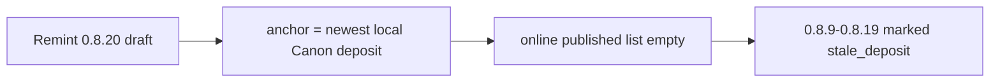

# Fix massale `stale_deposit` na remint

## Antwoord op je vraag

**Nee — niet omdat alle lokale `.zenodo.json` “aangeraakt”/corrupt zijn.**

Wat er wél gebeurde:

1. Remint van **v0.8.20** schreef terecht een nieuwe draft (`deposit 21530432`) in die ene config.
2. Bij Refresh kiest [`resolve_canon_concept_anchor`](c:/workspace/projects/SwirlStringTheory/tools/zenodo_tools/publish_canon_zenodo.py) nu die **nieuwste lokale deposit die in de Canon-familie zit** — dat is de **draft**.
3. [`fetch_online_canon_versions`](c:/workspace/projects/SwirlStringTheory/tools/zenodo_tools/publish_canon_zenodo.py) list daardoor bijna geen **published** 0.8.x meer (live check: `published 0.8.x = []`, alleen draft `0.8.20`).
4. [`local_deposit_is_stale`](c:/workspace/projects/SwirlStringTheory/tools/zenodo_tools/publish_canon_zenodo.py) ziet: lokale `deposit_id` staat niet in de (te korte) online-lijst → **vals positief `stale_deposit`** voor o.a. 0.8.9–0.8.19, terwijl die records nog gewoon published op Zenodo staan.

**Echte stale** (na fix nog steeds): 0.8.21–0.8.23 met DOI/deposit `21249058–60` (niet in Canon-familie). Die horen Remint/correcte mint.

`--refresh-descriptions` / Gemini-scrub raakte descriptions; dat veroorzaakt deze status-storm niet.

## Fix (concreet)

In [`publish_canon_zenodo.py`](c:/workspace/projects/SwirlStringTheory/tools/zenodo_tools/publish_canon_zenodo.py):

1. **`resolve_canon_concept_anchor`**: bij het kiezen van een lokaal anker **alleen published deposits** gebruiken (deposit `submitted`/`state=done`, of online state published). Drafts nooit als list-anker. Fallback blijft `CONCEPT_DOI`.
2. **`fetch_online_canon_versions`**: list altijd via dat published/concept-anker; drafts apart mergen (bestaande `collect_*_drafts`).
3. **`local_deposit_is_stale` aanscherpen**: niet stale als er een online match is op **zelfde version + zelfde DOI** (published of draft), ook als deposit-id-check faalt door incomplete list; wél stale als deposit onbekend **én** geen DOI-match online.
4. Korte unit-test: lokale 0.8.19 published-config + nieuwe 0.8.20 draft → fetch/compare markeert 0.8.19 **niet** als `stale_deposit`.

## Verificatie

- Refresh GUI: 0.8.9–0.8.19 weer `published` / metadata-bijwerkbaar.
- 0.8.20 = `draft_online`.
- 0.8.21–0.8.23 blijven terecht remint-kandidaten (verkeerde DOI-familie), tenzij je die later correct mint.

## Buiten scope

- Massa-remint van alle historische editions
- PDF-herupload
