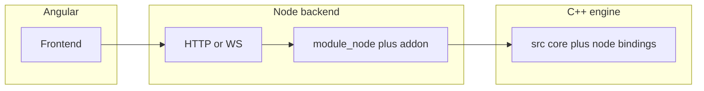

# N-API C++-engine voor Angular (npm `SSTcore` / `sstcore`)

## Doel en relatie tot Python

- **Primair doel**: de **npm-install** levert een **native C++-engine** die je vanuit **Node** (backend naast Angular) kunt aanroepen voor zware berekeningen. Er is **geen** vereiste dat npm en pip dezelfde JS/Python-API hebben of samenwerken.
- **Python (pip)** blijft een **apart** product: [module_sst.cpp](c:/workspace/projects/SSTcore/src/module_sst.cpp) + `*_py.cpp` + [setup.py](c:/workspace/projects/SSTcore/setup.py). Handig om te zien **welke** C++-modules bestaan en hoe argumenten heten—maar **geen** harde parity-doelstelling voor Node.
- **Angular**: draait in de browser; rekentypisch **HTTP/WebSocket** naar een Node-server die `require('…')` op de addon doet. **WASM** ([module_wasm.cpp](c:/workspace/projects/SSTcore/src/wasm/module_wasm.cpp)) is een apart traject als je ooit **zonder** server-side Node wilt rekenen in de browser.

## Huidige situatie (kort)

- **Node ([binding.gyp](c:/workspace/projects/SSTcore/binding.gyp))** linkt een **subset** van core `.cpp` en veel `node_*.cpp` zijn nog **stubs**. Werkende voorbeelden: o.a. **biot_savart**, **fluid_dynamics**, **frenet_helicity**.
- **JS-laag**: [index.js](c:/workspace/projects/SSTcore/index.js) laadt `build/Release/swirl_string_core.node`; [NODE_API_MODULE](c:/workspace/projects/SSTcore/src/node/module_node.cpp) heet nog `swirl_string_core`. Versie hardcoded vs [package.json](c:/workspace/projects/SSTcore/package.json).

## Methodologie: Node-bindings schrijven (afgesproken)

- **Referentie-implementatie**: [src/node/node_biot_savart.cpp](c:/workspace/projects/SSTcore/src/node/node_biot_savart.cpp) — dit is het **voorbeeld** voor alle toekomstige Node-exports.
  - Include het domein-header uit `../` (bijv. `../biot_savart.h`), `napi.h`, en [src/node/node_utils.h](c:/workspace/projects/SSTcore/src/node/node_utils.h).
  - Free functions / static C++ API: `exports.Set("camelCaseName", Napi::Function::New(env,  -> Napi::Value { ... }))`.
  - JS-args: arrays of `Float64Array` waar nodig; conversie via `js_array_to_vec3_list`, `js_typedarray_to_vec3_list`, `vec3_list_to_js_typedarray`, enz. (uitbreiden in `node_utils` als een domein nieuwe types nodig heeft).
  - Fouten: `Napi::TypeError` / `Napi::Error` met korte, actionable messages (zelfde toon als biot_savart).
  - Instance-classes in C++: hetzelfde patroon uitbreiden met `Napi::ObjectWrap` of factory-functies op `exports` — nog steeds consistent met biot_savart’s strict arg-checking en utils.
- **Bron van waarheid (nieuwste code)**:
  - **Primair**: C++ in **./src** — de headers en `.cpp` **zonder** suffix `_py` (de eigenlijke API en gedrag).
  - **Secundair**: het bijbehorende `*_py.cpp` — **referentie** (namen, overloads, veelgebruikte paden); Node hoeft **niet** alle Python-symbolen te spiegelen.
- **Geen afwijkende stijl**: geen nieuwe “stub-only” patronen; wat je **wel** exporteert, moet biot_savart-kwaliteit hebben (args, errors, utils).

## Wat we **niet** meer als must hebben

- Geen vereiste **1:1 exportlijst** met [module_sst.cpp](c:/workspace/projects/SSTcore/src/module_sst.cpp).
- Geen vereiste `list_bindings` compatibel met Python (optioneel voor documentatie/debug).

## Wat we **wel** willen

1. **Stable, documented JS surface** voor de berekeningen die de **Angular + Node**-stack nodig heeft (pragmatische subset van ./src).
2. **Zelfde C++ motor** als in de repo (./src); geen fork van de fysica—alleen **welke** functies je via N-API uitgeeft is productgestuurd.
3. **Pip-only zaken** (Python resources in [SSTcore/**init**.py](c:/workspace/projects/SSTcore/SSTcore/__init__.py)) blijven **Python**; voor Angular alleen relevant als je bewust assets via npm wilt shippen (optioneel, Fase H).

## Aanbevolen aanpak (fases)

### Fase 0 — API voor Angular afbakenen

- Lijst welke endpoints/features de Angular-app nodig heeft → welke `bind`_* / welke headers in ./src. Alleen **die** core `.cpp` en `node_*.cpp` volledig maken; rest kan stubs blijven of lazy.

### Fase A — Build en entrypoint rechttrekken

- **[binding.gyp](c:/workspace/projects/SSTcore/binding.gyp)**: voeg **alleen** de core `.cpp` toe die de gekozen N-API surface nodig heeft (niet automatisch de volledige Python `src_files`-lijst tenzij je alles wilt).
- Hernoem target `swirl_string_core` → `sstcore`, pas `NODE_API_MODULE` aan in [module_node.cpp](c:/workspace/projects/SSTcore/src/node/module_node.cpp).
- **[index.js](c:/workspace/projects/SSTcore/index.js)**: `require('./build/Release/sstcore.node')` + fallback oude naam indien gewenst voor backwards compatibility.
- Versie: trek `version` uit `package.json` in JS of zet C++ string gelijk aan package version.

### Fase B — Kleine N-API ports (biot_savart-patroon)

- Implementeer tegen [magnus_integrator.h](c:/workspace/projects/SSTcore/src/magnus_integrator.h) en [sst_integrator.h](c:/workspace/projects/SSTcore/src/sst_integrator.h); gebruik [magnus_integrator_py.cpp](c:/workspace/projects/SSTcore/src/magnus_integrator_py.cpp) en [sst_integrator_py.cpp](c:/workspace/projects/SSTcore/src/sst_integrator_py.cpp) alleen om exportnamen en argumenten af te vinken.
- Nieuwe of uitgebreide `node_magnus_integrator.cpp`, `node_sst_integrator.cpp` (bijv. `computeSstMass` → JS-array `[m_core, m_fluid]`).
- Koppel in `module_node.cpp` in een **logische volgorde** (mag afwijken van Python); houd exports stabiel zodra Angular erop leunt.

### Fase C — Ab-initio / particle zoo

- Leidend: [ab_initio_mass.h](c:/workspace/projects/SSTcore/src/ab_initio_mass.h) (+ `.cpp`); checklist: [ab_initio_mass_py.cpp](c:/workspace/projects/SSTcore/src/ab_initio_mass_py.cpp).
- Classes/methoden in Node: zelfde stijl als biot_savart (strict args, utils voor nested arrays). Python `relax` + signalen: in Node geen `PyErr_CheckSignals`; optioneel lege interrupt of latere callback-hook.

### Fase D — SST extensions

- Leidend: [sst_extensions.h](c:/workspace/projects/SSTcore/src/sst_extensions.h); checklist: [sst_extensions_py.cpp](c:/workspace/projects/SSTcore/src/sst_extensions_py.cpp).
- Vervang stub [node_sst_extensions.cpp](c:/workspace/projects/SSTcore/src/node/node_sst_extensions.cpp): result-objecten als plain JS-objects of kleine wrappers; functies als `Napi::Function::New` zoals biot_savart.

### Fase E — Overige domeinen (on-demand)

Alleen uitwerken als de Angular/backend-roadmap het vraagt: open **domein-header in ./src**, `node_*.cpp` in **node_biot_savart-stijl**, `*_py.cpp` als referentie.

- Voorbeeld groot blok: [knot_dynamics.h](c:/workspace/projects/SSTcore/src/knot_dynamics.h) + [knot_dynamics_py.cpp](c:/workspace/projects/SSTcore/src/knot_dynamics_py.cpp).
- Overige modules: field_ops, field_kernels, knot, enz. — zelfde werkschema, **geen** verplichting alles te vullen.

### Fase F — `list_bindings` (optioneel)

- Alleen als handig voor docs/debug; **geen** Python-formaat vereist.

### Fase G — Tests en CI

- [tests/test_basic.js](c:/workspace/projects/SSTcore/tests): dek de **gekozen** product-API; CI ([test-npm.yml](c:/workspace/projects/SSTcore/.github/workflows/test-npm.yml)) daarop afstemmen.

### Fase H (optioneel) — Resources zoals pip

- `package.json` `files`: include `SSTcore/resources/` (of symlink/copy bij build).
- Klein `lib/resources.js` met `getResourcesDir()`-achtige logica (analoog aan Python).

### Fase I — `node_examples/` (TypeScript, spiegel van Python `examples/`)

**Doel**: dezelfde **rekenintentie** als de Python-scripts in [examples/](c:/workspace/projects/SSTcore/examples/), maar dan in **TypeScript** voor Node-consumenten (Angular-backend, tooling). Eén voorbeeldbestand per **N-API-bronbestand** onder [src/node/](c:/workspace/projects/SSTcore/src/node/).

**Layout** (nieuw onder repo-root, naast `examples/`):

- `node_examples/README.md` — overzicht, hoe runnen (`npx tsx …` of `tsc` + `node`), en een **mappingstabel** Python-voorbeeld → TS-voorbeeld (bijv. [example_biot_savart.py](c:/workspace/projects/SSTcore/examples/example_biot_savart.py) → `biot_savart.example.ts`).
- `node_examples/tsconfig.json` (extends root of minimaal `moduleResolution`/`target` voor Node 18+).
- Per `node_*.cpp` exact **één** sibling-naam in TS, conventie: **stem** van het cpp-bestand + `.example.ts` (Python-tegenhangers in [examples/](c:/workspace/projects/SSTcore/examples/) waar die bestaan):
  - `node_biot_savart.cpp` → `biot_savart.example.ts` — [example_biot_savart.py](c:/workspace/projects/SSTcore/examples/example_biot_savart.py), [biot-savart_on_fseries.py](c:/workspace/projects/SSTcore/examples/biot-savart_on_fseries.py)
  - `node_fluid_dynamics.cpp` → `fluid_dynamics.example.ts` — o.a. [example_fluid_rotation.py](c:/workspace/projects/SSTcore/examples/example_fluid_rotation.py)
  - `node_field_kernels.cpp` → `field_kernels.example.ts` — dichtstbijzijnde py of minimale sanity-check
  - `node_field_ops.cpp` → `field_ops.example.ts` — idem
  - `node_knot.cpp` → `knot.example.ts` — knot-gerelateerde py
  - `node_frenet_helicity.cpp` → `frenet_helicity.example.ts` — o.a. [HelicityCalculation.py](c:/workspace/projects/SSTcore/examples/HelicityCalculation.py)
  - `node_potential_timefield.cpp` → `potential_timefield.example.ts` — N-API-bind heet `timefield`; o.a. [example_potential_flow.py](c:/workspace/projects/SSTcore/examples/example_potential_flow.py) waar passend
  - `node_hyperbolic_volume.cpp` → `hyperbolic_volume.example.ts` — o.a. [knot_pd_and_volume_example.py](c:/workspace/projects/SSTcore/examples/knot_pd_and_volume_example.py)
  - `node_radiation_flow.cpp` → `radiation_flow.example.ts` — [example_radiation_flow.py](c:/workspace/projects/SSTcore/examples/example_radiation_flow.py)
  - `node_swirl_field.cpp` → `swirl_field.example.ts` — trefoil-gerelateerde py waar relevant
  - `node_thermo_dynamics.cpp` → `thermo_dynamics.example.ts` — dichtstbijzijnde py
  - `node_time_evolution.cpp` → `time_evolution.example.ts` — vergelijkbaar tijd-stap-voorbeeld in `examples/` indien aanwezig
  - `node_vortex_ring.cpp` → `vortex_ring.example.ts` — [example_vortex_ring.py](c:/workspace/projects/SSTcore/examples/example_vortex_ring.py)
  - `node_vorticity_dynamics.cpp` → `vorticity_dynamics.example.ts` — o.a. [example_vorticity_transport.py](c:/workspace/projects/SSTcore/examples/example_vorticity_transport.py)
  - `node_sst_gravity.cpp` → `sst_gravity.example.ts` — [example_sst_gravity.py](c:/workspace/projects/SSTcore/examples/example_sst_gravity.py)
  - `node_sst_extensions.cpp` → `sst_extensions.example.ts` — nog **niet** gebonden in [module_node.cpp](c:/workspace/projects/SSTcore/src/node/module_node.cpp); placeholder tot `bind_extensions` live is

**Implementatie-details**:

- Import native surface via bestaande package-entry ([index.js](c:/workspace/projects/SSTcore/index.js) / types [index.d.ts](c:/workspace/projects/SSTcore/index.d.ts)) — `import … from '..'` bij runnen uit repo of `from 'SSTcore'` als geïnstalleerd.
- Waar de Node-binding nu nog een **stub** is (`*Available: false`), het TS-voorbeeld **wel** aanmaken: korte uitleg + `skip` of duidelijke melding zodat de map **compleet** blijft en CI later kan asserten “geen ontbrekend bestand”.
- **Geen** verplichting alle Python edge cases na te bootsen; wel dezelfde **kernquantiteit** (zelfde inputgrootte-orde, vergelijkbare output-checks waar zinvol).

**Tooling** (in [package.json](c:/workspace/projects/SSTcore/package.json)):

- `devDependency`: bijv. `tsx` om `.ts` direct te draaien, of build-stap met `tsc`.
- Scripts: bijv. `example:biot`: `tsx node_examples/biot_savart.example.ts`, en optioneel `examples:node:all` die alle `.example.ts` sequentieel draait (stub-skip respecteren).
- Overweeg `node_examples/` op te nemen in `files` als je voorbeelden **mee** wilt shippen op npm (anders alleen repo-doc).

### Fase J (optioneel) — Dashboard / Angular als consumer

- **SST_Dashboard** ([SST_Dashboard/](c:/workspace/projects/SSTcore/SST_Dashboard)) is vandaag vooral **Python**; als “goed idee” voor later: een **Angular** (of hybride) dashboard dat dezelfde operaties aanroept als `node_examples` — idealiter via een dunne **HTTP-API** in Node die 1:1 de functies uit de voorbeelden blootstelt. Dan zijn de `.example.ts`-bestanden het **contract** (welke argumenten, welke responses) voor backend-handlers die de frontend gebruikt.
- Mini-scope: geen volledige dashboard-rewrite in deze fase; wel in het plan vastleggen dat **node_examples** de referentie-implementatie is voor toekomstige dashboard-integratie.

## Scope-keuze (herbevestigd)

- **Geen** doel “npm === pip”. **Wel**: betrouwbare **C++-engine** achter **Angular** (via Node).
- Volledige port van alle domeinen blijft **optioneel** en alleen nuttig als de frontend roadmap dat vraagt.

## `npm install` en Angular

- Package blijft bruikbaar als dependency in een **Node-backend** naast Angular; de browser laadt **geen** `.node` direct—dat is normaal.
- [package.json](c:/workspace/projects/SSTcore/package.json): `name`/registry lowercase blijft een publish-detail; los van Python.

