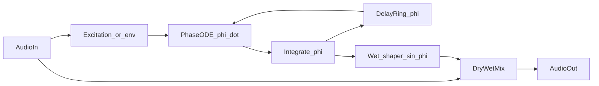

# Nonlineaire delayed-phase VST als kanaal-effect (Reaper)

## Doel (fase 1)

- **Plugin-type**: `juce::AudioProcessor` als **VST3 audio effect** (geen instrument), geschikt als insert op een track in Reaper.
- **Signaalpad**: audio in → interne **fase-state** met delayed feedback → **wet** signaal → **dry/wet** mix → audio uit.
- **Later (niet in fase 1)**: MIDI-gestuurde oscillatoren, arpeggiator, extra filters — alleen vastleggen als uitbreidingspunt (bijv. aparte branch of `AudioProcessor` uitbreiden met optionele `MidiBuffer`-verwerking).

## Theoretische koppeling

Je eigen vergelijking staat al als minimal normal form in [SST-85 rotating-fluid manuscript](c:/workspace/projects/SwirlStringTheory/papers/SST-85_Delayed%20Mode%20Selection%20and%20Parity-Separated%20Observables%20in%20a%20Rapidly%20Rotating%20Fluid%20Column%20with%20Event-Triggered%20Reinjection/SST-85_Delayed%20Mode%20Selection%20and%20Parity-Separated%20Observables%20in%20a%20Rapidly%20Rotating%20Fluid%20Column%20with%20Event-Triggered%20Reinjection.tex):

```417:426:c:/workspace/projects/SwirlStringTheory/papers/SST-85_Delayed Mode Selection and Parity-Separated Observables in a Rapidly Rotating Fluid Column with Event-Triggered Reinjection/SST-85_Delayed Mode Selection and Parity-Separated Observables in a Rapidly Rotating Fluid Column with Event-Triggered Reinjection.tex
Let $\phi(t)$ denote a phase-like variable describing the state of the reinforced axial response. The minimal delay model is then
\begin{equation}
\dot{\phi}(t)
=
\omega_0
+
\kappa_{\mathrm{eff}}
\sin\!\bigl[\phi(t-\tau_{\mathrm{eff}})-\phi(t)\bigr],
\label{eq:reduced_phi}
\end{equation}
```

Discrete tijd (audio): sampleperiode h = 1/f_s, delay \tau \rightarrow bufferlengte D \approx \tau f_s (fractionele \tau via lineaire interpolatie tussen twee taps voor vloeiende knoppen).

## Architectuur (hoog niveau)




## Kern-DSP-keuzes (aanbevolen voor v1)

1. **State**: één (of per kanaal) **continue fase** \phi (double, liefst **unwrapped** accumulatie) + **ringbuffer** met historie van \phi voor \phi(t-\tau).
2. **Discrete integratie**: start met **semi-impliciete Euler** of **RK4** per sample (RK4 vaak prettiger bij grotere \kappa / stijve dynamiek); stabiliteit testen op 44.1/48/96 kHz.
3. **Audio koppelt aan de loop (effect i.p.v. pure synth)** — minimaal één van:
  - **Injectie op \dot\phi**: \dot\phi = \omega_0 + \kappa\sin(\phi_d-\phi) + \lambda \cdot s(t) met s(t) bv. genormaliseerde **Hilbert-quadratuur** of band-pass / HP van de input (excitatie zonder de hele fase te “overstemmen”).
  - **Wet shaper**: `wet = sin(φ) * env(t)` met `env` een eenvoudige **envelope follower** op |in|, zodat stilte niet onnodig “zingt” (optioneel schakelbaar: **self-osc** aan/uit).
4. **Stereo**: begin met **dual-mono** (twee onafhankelijke \phi, gedeelde of onafhankelijke params) — eenvoudig en voorspelbaar; eventueel later L/R-koppeling toevoegen.

## Parameters (fase 1)


| Parameter                               | Rol                                             |
| --------------------------------------- | ----------------------------------------------- |
| \tau / Delay time                       | Circulatietijd → mode-spacing \sim 2\pi/\tau    |
| \kappa                                  | Koppelsterkte delayed-phase feedback            |
| \omega_0                                | Bias / “intrinsieke” rotatie (rad/s of Hz-knop) |
| Dry / Wet                               | Insert-mix                                      |
| Excitation amount \lambda               | Hoe sterk input de fase aandrijft               |
| (optioneel) Self-osc toggle / threshold | Gedrag bij stilte                               |


Gebruik **smoothing** op alle knoppen (JUCE `LinearSmoothedValue` / parameter ramps) om Reaper-automation zipless te houden.

## Project / toolchain

- **Repository**: alle implementatie in `[SST_Nonlineaire_Delayed-Phase_VST](c:/workspace/projects/SST_Nonlineaire_Delayed-Phase_VST)` (eigen git-repo; niet in SwirlStringTheory).
- **IDE**: **CLion** — **File → Open** op de **projectroot** (map met top-level `CMakeLists.txt`), hetzelfde werkpatroon als [SSTcore](c:/workspace/projects/SSTcore): CMake wordt de bron van waarheid; build directory bv. `cmake-build-release` / `cmake-build-debug` naast de bronnen of onder `%USERPROFILE%` volgens je CLion-instelling.
- **CMake, gelijk aan SSTcore (patronen, geen pybind)**:
  - `cmake_minimum_required(VERSION 3.23)` en expliciete C++-standaard (minimaal wat JUCE vereist, typisch **C++17** of **20**; SSTcore gebruikt C++23 — pas aan zodra JUCE + toolchain het toelaten).
  - Zelfde stijl van **platformdetectie** (`Windows` / `Darwin` / `Linux`) en **MSVC**-release-opties waar van toepassing (`/O2` in Release, geen conflict met Debug `/RTC1`), vergelijkbaar met het begin van [SSTcore/CMakeLists.txt](c:/workspace/projects/SSTcore/CMakeLists.txt).
  - **Vendored dependency** in `**extern/`** (analogaan `extern/pybind11` in SSTcore): bv. **JUCE als git submodule** `extern/JUCE`, daarna `add_subdirectory(extern/JUCE)` en `juce_add_plugin(...)`.
- **Targets**: **VST3** (en optioneel Standalone voor snel testen); Reaper op Windows laadt de gegenereerde `.vst3`-bundle uit de CMake-buildmap.
- **UI**: minimalistisch (sliders) — genoeg om te tunen in v1.

## Testplan

- Reaper: insert op track, sine sweep / drums / stem — check CPU, geen denormals (kleine DC-offset of `juce::dsp::DenormalDisabler`).
- Automatisatie van \tau, \kappa tijdens playback.
- Vergelijk gedrag bij korte \tau + hoge \kappa met verwacht “kam-/resonator” karakter; luister naar lock-in / mode-jumps (verwacht bij dit model).

## Fase 2 (alleen schets, niet bouwen in v1)

- **MIDI in**: optioneel `isMidiEffect` of synth-style note-on die \omega_0 of \tau quantize’t / arpeggiator-triggers.
- Extra **oscillator bank** of **filters** in parallel op de wet-chain.

## Belangrijk risico / scope

- Zuiver **autonoom** de ODE draaien zonder input-koppeling klinkt als synth; jouw keuze “eerst effect” vereist daarom expliciet **injectie + dry/wet** (of vergelijkbaar) zodat de track het gedrag hoort.

