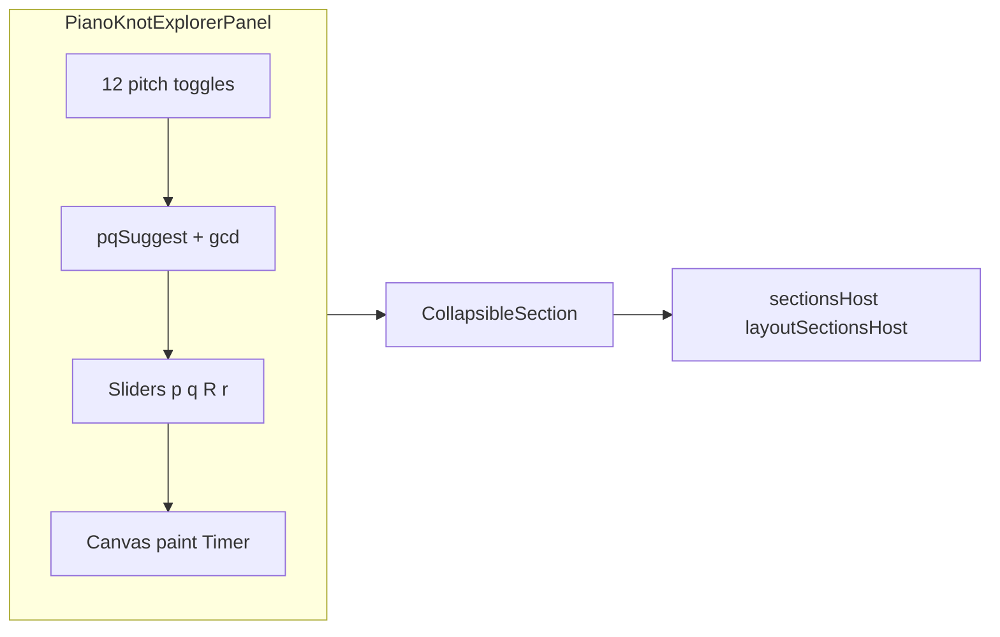

# Piano / torus-knoop visualisatie (nieuwe CollapsibleSection)

## Context

- **[stringtheory_pdf.html](c:/workspace/projects/SST_Nonlineaire_Delayed-Phase_VST/inspiration/stringtheory_pdf.html)** en **[stringtheory_pdf (1).html](c:/workspace/projects/SST_Nonlineaire_Delayed-Phase_VST/inspiration/stringtheory_pdf%20(1).html)** leveren het **concrete render-patroon**: parametrisatie `x(σ), y(σ), z(σ)`, rotatie, perspectief-projectie, segment-sortering op Z, lijn-tekening met fasekleur of effen kleur, sliders `p,q,R,r`, auto-rotate, plus in `(1)` `**gcd(p,q)` → “Single Knot” vs “Link (g components)”**.
- **[Piano-knopen-en-akkoorden.md](c:/workspace/projects/SST_Nonlineaire_Delayed-Phase_VST/inspiration/Piano-knopen-en-akkoorden.md)** / **(2)** zijn **conceptueel** (12 pitch classes, akkoord als link, suggestie om MIDI → `(p,q)` te mappen); er is **geen** kant-en-klare UI-specificatie. De 1600+ regels markdown **niet** runtime inladen: een **korte vaste samenvatting** (NL) in het paneel + **één expliciete heuristiek** voor `(p,q)` uit geselecteerde pitch classes.

## Architectuur (hoog niveau)

## Implementatie

### 1. Nieuwe bronbestanden

- Voeg `**Source/PianoKnotTheory.h**` (klein, header-only) toe met:
  - `int gcdInt(int a, int b)` (zelfde idee als in HTML).
  - `std::pair<int,int> suggestPQFromPitchClasses(std::span<const int> pcsMod12SortedUnique)` gebaseerd op het **idee** uit het Piano-gesprek (bijv. `p` ~ 1 + aantal actieve toonklassen + bonus voor majeur-triad `{0,4,7}` mod relatieve root; `q` ~ 1 + som intervalklassen t.o.v. laagste PC), met **clamp** naar zinnige ranges (bijv. `p,q` in 1…15 zoals de HTML) en documentatie in commentaar dat dit een **speelgoed-mapping** is.
  - Hulptekststring(s) (const `char`*) voor 2–3 zinnen theorie (pitch class → basisvorm, akkoord als link, `gcd`).
- Voeg `**Source/PianoKnotExplorerPanel.h` / `.cpp`** toe: `juce::Component` + `juce::Timer` (~30 Hz, vergelijkbaar met `[PwmScope](c:/workspace/projects/SST_Nonlineaire_Delayed-Phase_VST/Source/PluginEditor.cpp)` / `VortexCanvas`).
  - **State**: `p,q` (int), `R,r` (float), `rotX, rotY`, `autoRotate`, `phaseColor` bool, `selectedPitchClass[12]` bools.
  - **Child controls**: 4 sliders (of `juce::Slider`), 2 `TextButton`, 12 kleine `ToggleButton` of `TextButton` “C … B”, één knop **“Stel (p,q) uit selectie”** die `suggestPQFromPitchClasses` aanroept en sliders zet; optioneel **“Wis selectie”**.
  - `**paint`**: kopieer de logica uit HTML: punten over σ ∈ [0,2π], `rotate3D`, projectie, sorteer segmenten op gemiddelde Z, teken lijnen (JUCE `Graphics::drawLine` / `Path`; **geen** `shadowBlur` i.v.m. performance — subtiele alpha/dikte volstaat).
  - **Muis**: sleep op canvas past `rotX/rotY` aan en zet auto-rotate uit (zelfde UX als HTML).
  - **Label** (bijv. `juce::Label knotTypeLabel_`): toon `gcd(p,q)==1` → “Enkele torus-knoop” anders “Link (g componenten)” — NL, analoog aan `stringtheory_pdf (1).html`.

### 2. Editor-integratie

- In **[PluginEditor.h](c:/workspace/projects/SST_Nonlineaire_Delayed-Phase_VST/Source/PluginEditor.h)**: forward declare `PianoKnotExplorerPanel`; members `std::unique_ptr<PianoKnotExplorerPanel> pianoKnotPanel`_, `std::unique_ptr<CollapsibleSection> sectionPianoKnot_`.
- In **[PluginEditor.cpp](c:/workspace/projects/SST_Nonlineaire_Delayed-Phase_VST/Source/PluginEditor.cpp)** (constructor nabij `explorerTab`_ / `sectionSeq_`):
  - `pianoKnotPanel_ = std::make_unique<PianoKnotExplorerPanel>();`
  - `sectionPianoKnot_ = std::make_unique<CollapsibleSection> ("Piano / torus-knoop (theorie)", pianoKnotPanel_.get(), kHPianoKnot, true);`
  - `wireLayout(*sectionPianoKnot_)` en `**place(*sectionPianoKnot_)`** in `[layoutSectionsHost](c:/workspace/projects/SST_Nonlineaire_Delayed-Phase_VST/Source/PluginEditor.cpp)` — logische plek: **na** de hydrodynamische explorer (`explorerTab_`) en **vóór** `sectionSeq_` (of direct daaronder; consistent met “verkenning” vóór MIDI/Seq).
- Kies vaste hoogte `**kHPianoKnot`** (~400–480 px); tune na eerste visuele test.
- **[CMakeLists.txt](c:/workspace/projects/SST_Nonlineaire_Delayed-Phase_VST/CMakeLists.txt)**: `PianoKnotExplorerPanel.cpp` bij `target_sources`.

### 3. Geen APVTS in v1

- Parameters **niet** toevoegen tenzij je later automatisering/presets wilt; alle state blijft in het paneel (zoals afgesproken: **geen host-MIDI in v1**).

### 4. Follow-ups (buiten deze scope, wel vermelden)

- **Echte multi-component tekening** wanneer `g = gcd(p,q) > 1`: eventueel `g` gescheiden σ-intervallen of fase-offsets (wiskundig netter dan één curve); nu volstaat **correcte tekst** + dezelfde enkel-curve als de HTML.
- **Live MIDI** naar pitch-class set en mapping.
- Optioneel: **WebView** met originele HTML — zwaarder en niet nodig als de JUCE-canvas voldoet.

## Bestanden die zeker wijzigen

| Bestand                                                                                             | Actie                                  |
| --------------------------------------------------------------------------------------------------- | -------------------------------------- |
| [CMakeLists.txt](c:/workspace/projects/SST_Nonlineaire_Delayed-Phase_VST/CMakeLists.txt)            | `PianoKnotExplorerPanel.cpp` toevoegen |
| [PluginEditor.h](c:/workspace/projects/SST_Nonlineaire_Delayed-Phase_VST/Source/PluginEditor.h)     | Members + forward decl                 |
| [PluginEditor.cpp](c:/workspace/projects/SST_Nonlineaire_Delayed-Phase_VST/Source/PluginEditor.cpp) | Sectie + layout                        |
| **Nieuw** `Source/PianoKnotTheory.h`                                                                | gcd + suggestPQ + korte theorie        |
| **Nieuw** `Source/PianoKnotExplorerPanel.h/.cpp`                                                    | UI + render loop                       |

## Acceptatie

- Nieuwe inklapbare sectie zichtbaar in de scroll-host; open/dicht werkt zoals bestaande secties.
- Torus-knoop zichtbaar, roteerbaar (auto + sleep), sliders werken; modus fasekleur/effen wisselt.
- 12 pitch-class toggles + knop zet `(p,q)`; `gcd`-label klopt met `(p,q)`.
- Geen regressie in build (MSVC Release).

