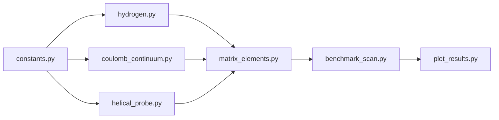

# SST-71 Helicity Asymmetry Benchmark Package

## Purpose and success criteria

- **Primary**: Numerically compute photoionization rates Gamma_{h=+1}(ω) and Gamma_{h=-1}(ω), then A_tot(ω) = (Γ₊ − Γ₋)/(Γ₊ + Γ₋), and verify **A_tot ≈ −8/17** for the axisymmetric helical probe (not by hardcoding the ratio).
- **Null controls**: (1) `use_anticommutator=False` (C_h = −2 for both h) → A_tot ≈ 0; (2) non-helical probe (h=0) → A_tot ≈ 0; (3) broken axisymmetry probe → exact −8/17 generally lost.
- **Deliverables**: 9 files in a single package directory; CSVs and figures from `benchmark_scan.py` and `plot_results.py`.

## Package location and layout

Create a new directory under the SST-71 paper folder:

- **Path**: `[SST-71_Toward_a_Canonical_Atomic_Torsion-Bridge_in_SST/benchmark/](c:/workspace/projects/SwirlStringTheory/SST-71_Toward_a_Canonical_Atomic_Torsion-Bridge_in_SST/benchmark/)` (new)
- **Files**: `constants.py`, `hydrogen.py`, `coulomb_continuum.py`, `helical_probe.py`, `matrix_elements.py`, `benchmark_scan.py`, `plot_results.py`, `README.md`, `requirements.txt`

All physics in SI internally; convert to eV only for reporting/plotting.

---

## 1. constants.py

- **SI**: `hbar`, `e`, `epsilon_0`, `c`, `m_e`, `alpha` (from fine-structure).
- **SST canonical** (from paper/Rosetta):  
`v_swirl = 1.09384563e6`, `r_c = 1.40897017e-15`, `rho_core = 3.8934358266918687e18`, `rho_f = 7.0e-7`, `F_swirl_max = 29.053507`.
- **Derived**:  
`eta_0 = v_swirl/c`, `Omega_0 = v_swirl/r_c`, `a0_sst = 2*r_c/alpha**2`, `E_R = hbar**2/(2*m_e*a0_sst**2)`.
- **Benchmark**: `A_expected = -8/17`; eV helper (e.g. `J_to_eV`).
- **Function** `print_constants_summary()`: print eta_0, Omega_0, hbar*Omega_0 in eV, a0_sst, E_R in eV.
- Use type hints; docstrings; fail on nonphysical inputs where relevant.

---

## 2. hydrogen.py

- **1s wavefunction**: ψ_1s(r) = (π a0³)^{-1/2} exp(−r/a0), with `a0 = a0_sst` by default (from constants).
- **Ionization energy**: I1 = E_R (same as ground-state binding).
- **API**: e.g. `psi_1s(r, a0=None)` and a helper that evaluates on arrays (r can be scalar or array).
- All in SI (length in m, ψ in m^{-3/2}).

---

## 3. coulomb_continuum.py

- **Role**: Attractive Coulomb continuum radial functions for Z/r potential using **mpmath**.
- **Inputs**: kinetic energy E_k (J), angular momentum l, radius r (m), optional Z=1, optional a0 (default a0_sst).
- **Coulomb parameter**: η_C = −Z/(k·a0) with k = √(2 m_e E_k)/ℏ (SI). For attractive potential, η < 0.
- **Implementation**: Use mpmath’s Coulomb wave API (e.g. `mpmath.coulombf`, `mpmath.coulombg` or equivalent) to build the **regular** solution suitable for bound–continuum overlap. Document normalization (e.g. energy-normalized or k-normalized) in docstrings; keep one consistent convention.
- **Robustness**: Default `mp.dps = 50`; option to increase; handle E_k ~ 0.1 eV (near threshold) and up to ≥ 100 eV.
- **Spherical harmonics**: Use `scipy.special.sph_harm(m, l, phi, theta)` (note scipy’s theta/phi convention) for Y_lm; document Condon–Shortley and (θ, φ) convention.
- **Helper**: e.g. continuum normalization convention used (e.g. density of states factor) documented and exposed so matrix_elements uses the same convention.

---

## 4. helical_probe.py

- **Coordinates**: Cylindrical (ρ, z) from spherical: ρ = r sin(θ), z = r cos(θ).
- **Axisymmetric envelope**: f(ρ, z) = exp(−ρ²/(2 w_r²)) exp(−z²/(2 w_z²)).
- **Pure-helicity probe** (spatial part, no time):  
γ_h(r, θ, φ; h, q, w_r, w_z, A_gamma) = A_gamma · f(ρ,z) · exp(i(h·φ + q·z)).
- **Control 1 – non-helical**: h=0 (no φ in phase), same f.
- **Control 2 – broken axisymmetry**: f_break = f(ρ,z) · (1 + eps·cos(2φ)); same phase exp(i(h·φ + q·z)).
- **API**: e.g. `gamma_h(r, theta, phi, h, q, w_r, w_z, A_gamma=1.0, eps=0)`; return complex; support array inputs where needed for quadrature.

---

## 5. matrix_elements.py (core physics)

- **Transition amplitude**: M_{Elm}^{(h)} ∝ C_h · I_{Elm}^{(h)}, with  
I_{Elm}^{(h)} = ∫ d³r [ψ_{Elm}^{(-)*}] γ_h ψ_1s.  
Use **regular** Coulomb waves (or incoming Coulomb convention) and document; if first version is internally consistent, asymmetry ratio is forgiving.
- **C_h**:  
  - Full model: C_h = −2 + h/2 ⇒ C_{(+1)} = −3/2, C_{(−1)} = −5/2.  
  - Null (no anticommutator): C_h = −2 for both h.
- **Partial-wave decomposition**: ψ_{Elm} = R_El(r) Y_lm(θ, φ). Integrate in spherical coordinates; separate φ (analytic or fine grid) so that **m = h** selection rule is visible numerically.
- **Rate**: Gamma_h(ω) ∝ |C_h|² × Σ_{l,m} |I_{Elm}^{(h)}|² (with density-of-states factor; same for both h so cancels in A_tot).
- **High-level API**:
  - `compute_partial_amplitude(E_k, l, m, h, params)` → complex (or real) amplitude.
  - `compute_total_rate(E_k, h, params, use_anticommutator=True, probe_type="helical")` → rate (arbitrary units ok; ratio matters).
  - `compute_asymmetry(E_k, params, use_anticommutator=True, probe_type="helical", **kwargs)` → A_tot.
  - `verify_selection_rule(E_k, h, params, l_max, ...)` → e.g. report |I_{lm}| for m≠h vs m=h to show dominance of m=h.
- **Convergence params** (dataclass or dict): R_max, N_r, N_theta, l_max, mp_dps. Defaults: R_max = 100*a0_sst, N_r = 400, N_theta = 256, l_max = 8, mp_dps = 50.
- Use scipy integration (e.g. `scipy.integrate.nquad` or nested 1D) with integrand that calls mpmath-backed Coulomb radial (convert mpmath to float at quadrature points if needed for speed, or use vectorized mpmath). Prefer correctness and stability over speed.

---

## 6. benchmark_scan.py

- **Photon energy scan**: 15 eV to 100 eV; E_k = ℏω − I1 (I1 in eV); skip points below threshold.
- **Default params**: w_r = w_z = a0_sst, q = 1/a0_sst, A_gamma = 1.0.
- **Compute**: Gamma_{h=+1}(ω), Gamma_{h=−1}(ω), A_tot(ω).
- **Runs**:
  1. Main benchmark: helical, axisymmetric, use_anticommutator=True → expect A_tot ≈ −8/17.
  2. No anticommutator: use_anticommutator=False → expect A_tot ≈ 0.
  3. Non-helical: probe_type="non_helical" (or equivalent) → expect A_tot ≈ 0.
  4. Broken axisymmetry: probe with eps>0 (e.g. 0.2) → A_tot deviates from −8/17.
- **Convergence study**: At one energy (e.g. 30 eV), vary R_max, N_theta, l_max; record A_tot and optionally rate; save to CSV.
- **Output**: Save CSVs (e.g. `benchmark_main.csv`, `control_no_anticommutator.csv`, `control_non_helical.csv`, `control_broken_axisymmetry.csv`, `convergence_study.csv`). Call `print_constants_summary()` at start.

---

## 7. plot_results.py

- **Input**: Read the CSVs produced by benchmark_scan.
- **Figures** (publication-style matplotlib, no custom colors unless needed):
  1. **A_tot(ω) vs photon energy (eV)** with horizontal reference line at −8/17; labeled axes and units.
  2. **Control comparison**: e.g. main vs no-anticommutator vs non-helical (asymmetry vs energy).
  3. **Convergence**: A_tot vs R_max, N_theta, or l_max at the chosen energy.
- **Save**: PNG and PDF for each figure.

---

## 8. README.md

- **Scientific purpose**: Benchmark of the reduced SST atomic bridge model for 1s photoionization helicity asymmetry; not a full first-principles derivation.
- **Equations**: Define A_tot(ω), C_h, axisymmetric γ_h, and state that the expected result is A_tot = (|C_+|² − |C_−|²)/(|C_+|² + |C_−|²) = −8/17 when overlap magnitudes match; null controls → A_tot ≈ 0.
- **Structure**: List the 9 files and their roles.
- **Install**: `pip install -r requirements.txt` (from package directory or parent).
- **Run**: `python benchmark_scan.py` (from package directory); then `python plot_results.py`.
- **Expected results**: Main run A_tot ≈ −8/17; no-anticommutator and non-helical → A_tot ≈ 0.

---

## 9. requirements.txt

```
numpy
scipy
mpmath
matplotlib
```

No version pins unless you want to fix minimum versions (e.g. Python 3.9+).

---

## Implementation order and dependencies




1. **constants.py** (no internal deps).
2. **hydrogen.py** (uses constants).
3. **coulomb_continuum.py** (uses constants; mpmath; scipy for sph_harm).
4. **helical_probe.py** (uses constants; numpy for exp).
5. **matrix_elements.py** (uses constants, hydrogen, coulomb_continuum, helical_probe; scipy integrate).
6. **benchmark_scan.py** (uses all of the above; writes CSVs).
7. **plot_results.py** (pandas optional; can use numpy loadtxt/csv; matplotlib).
8. **README.md**, **requirements.txt**.

---

## Numerical and coding standards

- **Defaults**: R_max = 100*a0_sst, N_r = 400, N_theta = 256, l_max = 8, mp_dps = 50.
- **Type hints** on public functions; **dataclass** for benchmark parameter bundles where useful.
- **Docstrings**: Purpose, arguments, returns, and (for physics) conventions (units, normalization).
- **Comments**: Brief physics/numerics notes (e.g. “φ integral enforces m = h”).
- **Fail loudly**: E_k < 0, l < 0, etc.
- **Coulomb**: First version can be “internally consistent and stable”; asymmetry is robust to a common normalization. If mpmath Coulomb API differs from standard (e.g. F, G normalization), document it and use consistently.

---

## Acceptance checklist (from spec)

- Package prints benchmark constants summary.  
- Axisymmetric helical benchmark gives A_tot close to −8/17 (computed from rates, not hardcoded).  
- No-anticommutator control → A_tot close to 0.  
- Non-helical control → A_tot close to 0.  
- Broken axisymmetry → A_tot generally not exactly −8/17.  
- CSVs and figures saved; easy to inspect and modify.

