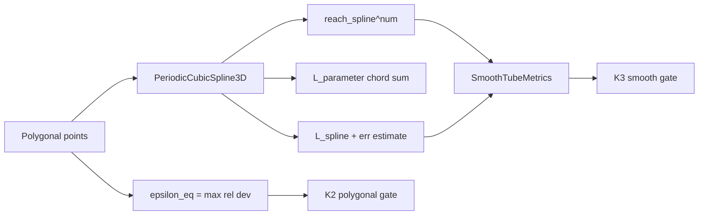

# SSTcore geometry-certificate laag (post-audit)

## Audit-oordeel (bevestigd tegen code)

Jouw gecorrigeerde oordeel klopt tegen [`c:\workspace\projects\SSTcore`](c:\workspace\projects\SSTcore):

| Auditpunt | Status |
|-----------|--------|
| M4 “continuous reach ontbreekt” | **Onjuist** — [`ContinuousReachSolver`](c:\workspace\projects\SSTcore\src\geometry\continuous_reach.h) + Python/Node bindings + unit-circle / two-circle tests bestaan |
| Smooth reach als bewezen reach | Nee — label als `reach_spline^num`; globale certificatie ontbreekt |
| Echte API-gap | Adaptive spline-arclength + error bound; niet de reachsolver zelf |
| `ε_eq` vs `edge_length_rel_std` | Gate in [`geometry_core.cpp`](c:\workspace\projects\SSTcore\src\tube\geometry_core.cpp) gebruikt rel_std; canon eist max-deviatie |
| Canon `(G_0)`–`(G_3)` conflict | Reëel in v0.8.21; knot-gates moeten `(K_*)` heten |
| Geen brede canonpatch nu | Correct; eerst softwarelaag |

**Belangrijke implementatieconstraint:** `PeriodicCubicSpline3D::length()` / `L_` is het **chord-parameterdomein** van de cubic (niet alleen een “verkeerde length”). Die semantiek blijft; echte booglengte komt als **aparte** API.



---

## Scope (deze ronde)

**In:** SSTcore C++ + Python/Node bindings + tests + licht protocoldocument.  
**Uit:** canon `.tex`-patch; `ε_seed` in `ε_geom`; Bishop framing / coreprofielen (`F_*`); productierun `3_1` Geometry Certificate v0.1 (die volgt ná deze laag).

Versie: additive API → package/engine bump naar **0.8.19** (canon-versie in headers blijft ongewijzigd).

---

## Stap 1 — SSTcore patch (vier wijzigingen)

### 1. Canonieke equilateral error

Bestanden: [`include/sst/tube/types.h`](c:\workspace\projects\SSTcore\include\sst\tube\types.h), [`include/sst/tube/geometry_core.h`](c:\workspace\projects\SSTcore\include\sst\tube\geometry_core.h), [`src/tube/geometry_core.cpp`](c:\workspace\projects\SSTcore\src\tube\geometry_core.cpp), plus Python/Node in [`geometry_py.cpp`](c:\workspace\projects\SSTcore\src\tube\geometry_py.cpp) / [`geometry_node.cpp`](c:\workspace\projects\SSTcore\src\tube\geometry_node.cpp).

- Voeg `edge_length_max_relative_deviation(points)` toe:
  - `max_i |ℓ_i / ℓ̄ − 1|`
- Voeg veld `edge_length_max_rel_dev` toe aan `ResolvedTubeMetrics`
- Zet `equilateral_ok = (edge_length_max_rel_dev <= equilateral_tol)`
- Behoud `edge_length_rel_std` als diagnostiek (niet normatief)

### 2. Smooth spline arclength

Bestanden: [`periodic_spline.h`](c:\workspace\projects\SSTcore\src\geometry\periodic_spline.h) / [`.cpp`](c:\workspace\projects\SSTcore\src\geometry\periodic_spline.cpp).

- Houd `length()` = chord-parameter `L_` (breaking change vermijden)
- Voeg toe:
  ```cpp
  struct SplineLengthResult {
      double length;
      double absolute_error_estimate;
      std::size_t interval_count;
      bool converged;
  };
  SplineLengthResult integrated_arclength(double abs_tol, double rel_tol) const;
  ```
- Implementatie: per chord-interval adaptieve Gauss–Kronrod (of equivalente adaptieve quadrature) van `‖γ′(u)‖`; self-contained, geen nieuwe externe dependency
- Unit-cirkel: `L_spline ≈ 2π` met foutschatting onder tolerantie

### 3. Search diagnostics op `ContinuousReachResult`

Bestanden: [`src/vortexlab/types.h`](c:\workspace\projects\SSTcore\src\vortexlab\types.h), [`continuous_reach.cpp`](c:\workspace\projects\SSTcore\src\geometry\continuous_reach.cpp), bindings in [`vortexlab_kernels_py.cpp`](c:\workspace\projects\SSTcore\src\vortexlab_kernels_py.cpp) / [`vortexlab_kernels_node.cpp`](c:\workspace\projects\SSTcore\src\vortexlab_kernels_node.cpp).

Instrumenteer bestaande curvature-loop (`per = 6` + golden section) en DCSD-seed/Newton/DLS-pad met minstens:

- `curvature_intervals_examined`, `dcsd_seed_count`, `dcsd_refined_count`, `dcsd_rejected_count`
- `search_resolution`, `refinement_tolerance`, `search_converged`

Exposeer deze velden in Python/Node dicts (nu ontbreken zelfs witnesses).

### 4. Gecombineerde `SmoothTubeMetrics` API

Nieuw: bv. `src/geometry/smooth_tube_metrics.{h,cpp}` (+ CMake/`setup.py`/`binding.gyp`).

```cpp
struct SmoothTubeMetrics {
    double spline_length;
    double spline_length_error;
    double curvature_radius;
    double self_dcsd;
    double self_radius;
    double inter_component_radius;
    double reach;                 // reach_spline^num
    double ropelength_rad;        // L_spline / reach
    double ropelength_diam;       // ½ ropelength_rad
    double orthogonality_residual;
    bool converged;
    ContinuousReachResult reach_detail; // inclusief diagnostics
    SplineLengthResult length_detail;
};

SmoothTubeMetrics analyze_smooth_resolved_tube(
    const std::vector<std::vector<Vec3>>& components, ...);
```

Bindings: `analyze_smooth_resolved_tube` / `analyzeSmoothResolvedTube`. Altijd beide ropelength-conventies exporteren.

Docs: update [`VORTEXLAB_KERNEL_STATUS.md`](c:\workspace\projects\SSTcore\docs\VORTEXLAB_KERNEL_STATUS.md); korte release note `RELEASE_NOTES_0.8.19.md`.

---

## Stap 2 — Protocol zonder canonduplicatie

Nieuw bestand: [`docs/GEOMETRY_CERTIFICATE_PROTOCOL_v0.1.md`](c:\workspace\projects\SSTcore\docs\GEOMETRY_CERTIFICATE_PROTOCOL_v0.1.md).

- Gate-tabel `(K_0)`–`(K_4)` + `(F_1)`–`(F_3)` zoals in jouw memo
- Elke gate **refereert** canon-labels (`eq:rt_equilateral_error`, Ridgerunner polygonal-to-smooth, `Rop_rad`/`Rop_diam` guard) — geen vergelijkingsduplicatie
- Definieer:
  - `RKS-Geometry Certified ⇔ K0∧K1∧K2∧K3∧K4`
  - `RKS-Field Certified` later
- Statuslabels: `reach_spline^num`, `Rop_smooth^ub` pas wanneer `L_spline` + reach diagnostics + geaccepteerde error bounds voldoen
- `ε_seed^{rop,contact,reach}` apart rapporteren; **niet** in `ε_geom` vouwen
- Canon-guards expliciet: kleine `R_CK` ≠ dynamische stabiliteit; Hodge-dim ≠ knoopclassificatie; niet elke strut heeft positieve contactkracht

Geen wijziging aan [`SST_CANON-v0.8.21*.tex`](c:\workspace\projects\SwirlStringTheory\SST-CANON\been_processed\v0.8.21).

---

## Stap 3 — Tests (volgorde A–E)

Uitbreiden van [`tests/test_vortexlab_kernels.py`](c:\workspace\projects\SSTcore\tests\test_vortexlab_kernels.py) en [`tests/test_resolved_tube_geometry.py`](c:\workspace\projects\SSTcore\tests\test_resolved_tube_geometry.py):

| Test | Inhoud | Bestaat al? |
|------|--------|-------------|
| A | Eenheidscirkel: `L≈2π`, `reach≈1`, `Rop_rad≈2π`, `Rop_diam≈π`; limiter CURVATURE/SELF_DCSD/TIE | gedeeltelijk (reach only) |
| B | Twee cirkels afstand 0.8 → `reach≈0.4`, `INTER_COMPONENT` | ja |
| C | Polygon met `rel_std < 1e-3` maar `max_rel_dev > 1e-3` → oude gate zou slagen, nieuwe `equilateral_ok=False` | **nieuw** |
| D | Ideale `3:1:1` embedding: exporteer `Rop_rad≈32.743274`, `Rop_diam≈16.371637` (tolerance band; registry heeft diameter-waarde) | **nieuw** voor smooth path |
| E | Multiresolutie `N=300,600,1200,2400` (+ spotcheck 4800 later) op converge van reach/`Rop_*` | **nieuw** |

Test C is de regressie die de code–canon mismatch hard vastlegt.

---

## Bewust uitgesteld

- `ε_seed` in `ε_geom`
- `(F_1)` Bishop / coreprofielen
- Brede canon `(K_*)`-introductie in LaTeX
- Volledige `3_1` Geometry Certificate v0.1 productierun (na 0_1-baseline op deze API)

---

## Acceptatiecriteria

1. `equilateral_ok` gateert op max-rel-dev; Test C faalt onder oude semantiek en slaagt onder nieuwe.
2. `integrated_arclength` op eenheidscirkel binnen tolerantie; `length()` ongewijzigd als chord-parameter.
3. `compute_continuous_reach` / `analyze_smooth_resolved_tube` exporteren diagnostics + beide `Rop_*`.
4. Protocol-doc linkt naar canon i.p.v. te kopiëren.
5. Geen v0.8.21 `.tex`-wijzigingen in deze PR/commit-reeks.
